# Features

## Core features

Annette platform is enterprise-wide platform. It can be used to build any number applications based on set API Gateways and microservices.

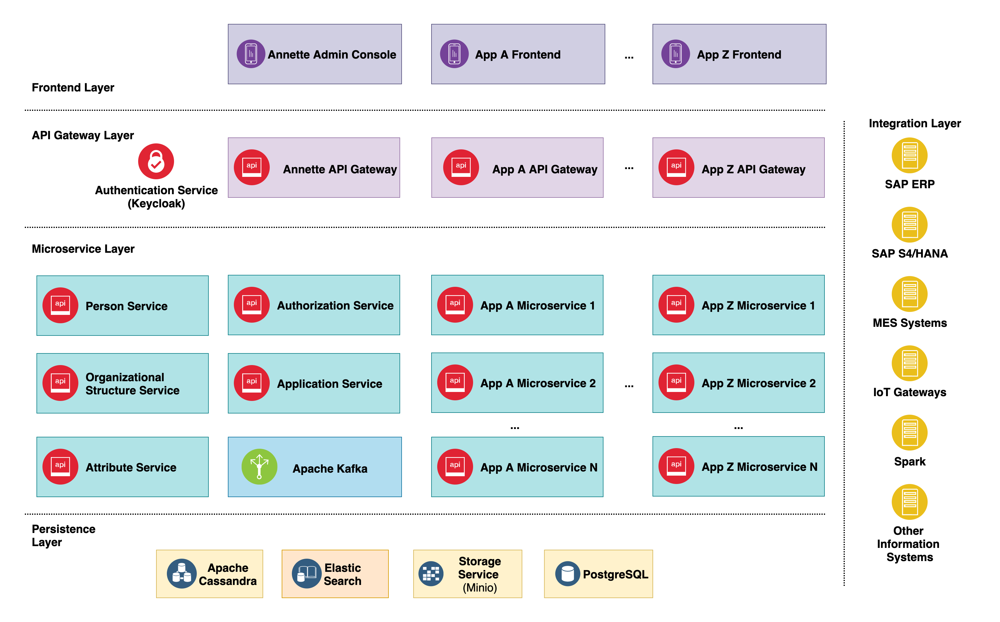

Annette platform contains the next layers:
* Frontend Layer contains frontend applications. For example, there could be Blogs & Business Communication application to provide staff with information related their duty, Finance application to manage financial tasks, Logistic application to perform logistics operation etc. Frontend Layer communicates to API Gateway Layer.
* API Gateway Layer responsible for processing requests comings from frontend applications or external systems. API gateways perform authentication and authorization and orchestrate microservices.
* Microservice Layer contains set of microservices that provides core functionality of applications  build on Annette Platform. Each microservice has single responsibility and can communicate to:
  * others microservices (synchronous by calling microservice API or asynchronous by using Apache Kafka)
  * Persistence Layer to store data and files
  * Integration Layer to exchange data with external information systems
* Persistence Layer stores data  in SQL/NoSQL DBs and store files in object storage
* Integration Layer performs communication with external information systems (SAP ERP, S/4HANA, MES, IoT Gateways, etc.)

### Cluster architecture & scalability

Annette platform has cluster architecture and provides scalability capabilities by design. It is designed to run in Kubernetes environment.

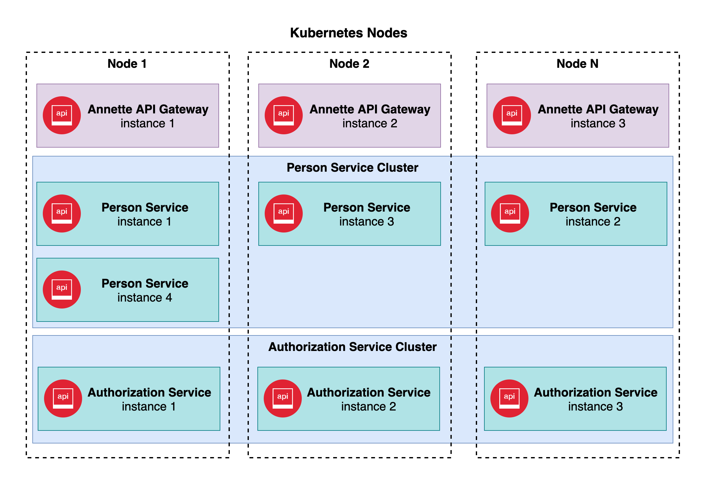

Annette platform layers that can be clustered:
* Microservice Layer 
* Persistence Layer (Cassandra, ElasicSearch, Minio)

Annette platform layers that can be ran in multiple instances:
* API Gateway Layer (as API Gateways are stateless, they can run in multiple instances without clustering)
* Microservice Layer 
* Persistence Layer (Cassandra, ElasicSearch, Minio)

### External & internal authentication

Annette platform provides internal and external authentication for API Gateways.
API Gateways can use both authentication methods at same time.

**Internal Authentication**

Security keys for basic authentication stored in Basic Authenticator Configuration  
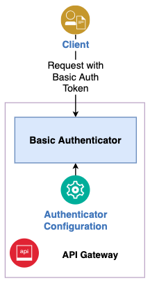

**External Authentication using Keycloak**

Keycloak can have own user database or can be integrated with external providers:
* Kerberos (Active Directory)
* LDAP
* SAML 2.0
* OpenID Connect 2.0
* Social providers (Google, Facebook, Twitter, Microsoft etc.)

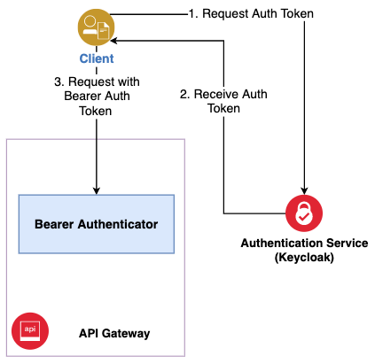

### External & internal authorization

Annette platform provides internal and external authorization for API Gateways.
API Gateway can use either internal authorization or external authorization.

**Internal authorization**

Internal authorization uses permission assignment to principals stored in local configuration file.

This authorization method is useful for simple cases.

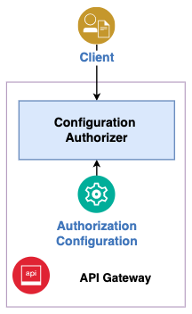

**External authorization**

External authorization calls to authorization service that store permission-principal assignments in distributed database (Cassandra).

This authorization method is useful for complex enterprise-wide authorization system.

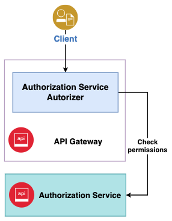

### Principals

Principal is the subject can be authorized to perform operations in Annette platform. Principal can be direct (references to person or technical account) or indirect (indirectly references to zero or more direct principals).

Direct principals:
* Person
* Technical account 

Indirect principals:
* Anonymous user
* Authenticated user
* Organizational position
* Organizational role
* Employee of a particular organizational unit (direct organizational unit)
* Employee of a particular organizational unit or its subunits (descendant organizational unit)
* Employee of a particular organization
* Chief of organizational unit 

**Principal derivation**

During authentication process the authenticator derives direct principal (person or technical account). Then it can derive indirect principals related to direct principal using Organizational Structure Service.
 
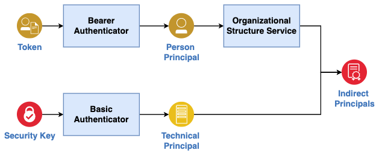

### Elastic Search integration

Annette platform has embedded integration with ElasticSearch to implement full-text search in platform microservices with the following capabilities:

* Creation of data structure schemas for searching by microservice entities
* Create documents based on specified data structures
* Perform full text search 

## Application service

Application service provides the following master data:

* Language catalog – contains list of languages can be used in applications.
* Message translations – contains list of messages and their translations to languages used in system 
* Application catalog – contains list of applications and their configurations

### Language catalog

Language catalog contains list of languages can be used in applications.
Language contains language id and name. For example:

* EN – English
* FR – French 
* RU – Russian
* PL – Polish 

User can select language in frontend application and interface will be updated according to selected language.

### Message translations

Message translations contains list of messages and their translations to languages used in system 
Message in system has unique id with format:

` <application id>.<service id>.<service message id> `

For example: message with id `axon.bpm.deploymentUI.deployed` can have translations:
 
* EN - Diagram {name} successfully deployed.
* FR - Le diagramme {name} a été déployé avec succès.

where `name` is message parameter. 

When user deploys BPMN diagram with name `Approve travel expenses` he or she will receive message: 

* `Diagram Approve travel expenses successfully deployed` – if English language selected or
* `Le diagramme Approve travel expenses a été déployé avec succès` – if French language selected

### Application catalog 

Application catalog contains list of applications and their configurations.

Application has the following attributes:
 
* Id – unique id of application
* Name – application name
* Caption – application caption contains reference to message, so it will be displayed to user in the selected language
* Translations – list of translations in format `<application id>.<service id>` required for application
* Server URL – link to site where the application is deployed

## Authorization service

Authorization Service has the following features:

* Flexible RBAC-based authority system
* Permissions are combined into roles and assigned to principals (users)
* Flexible system of assigning permissions:
  * Person
  * Technical account 
  * Anonymous user
  * Authenticated user
  * Organizational position
  * Organizational role
  * Employee of a particular organizational unit (direct organizational unit)
  * Employee of a particular organizational unit or its subunits (descendant organizational unit)
  * Employee of a particular organization
  * Chief of organizational unit 
* Search by authorization system: by permission, role and principal

## Persons service

Person Service has the following features:

* Maintaining a directory of persons (user, contact person, etc.)
* Flexible custom person attributes
* Full text directory search including custom attribute search
* Maintaining a directory of categories
* Assignment of categories to persons

### Person

Person - a person who either uses the application directly (user) or the application contains a link to it (contact person)

A person’s record contains unique id (person id), first name, middle name, last name, category, phone and email.

Category is a special attribute that assigned to each person. Category is used to classify persons and search purposes. For example, you can classify persons with two categories: user and contact person.

Other attributes (such as address, gender, date of birth, etc.) can be flexibly configured in the attribute service to suit business requirements.

Person service provides full-text search by person’s attributes.

## Organizational structure service

Organizational Structure Service has the following features:

* Maintaining an unlimited number of organizations
* Maintaining the organizational structure of an organization consisting of organizational units and positions
* Maintaining heads of departments
* Assignment to positions of persons from the person catalog
* Ability to create group positions with the assignment of several persons
* Maintaining a directory of categories
* Assignment of categories to organizations, organizational units and positions
* Maintaining a directory of organizational roles
* Assigning organizational roles to positions
* Flexible custom attributes of organization, organizational unit, position
* Full-text search by organizational units, positions, organizational roles
* Ability to maintain virtual organizations and virtual teams

### Organizational structure

Organizational structure - a hierarchical structure that represents one or more organizations.
Organizations are located at the top level of the hierarchical structure.

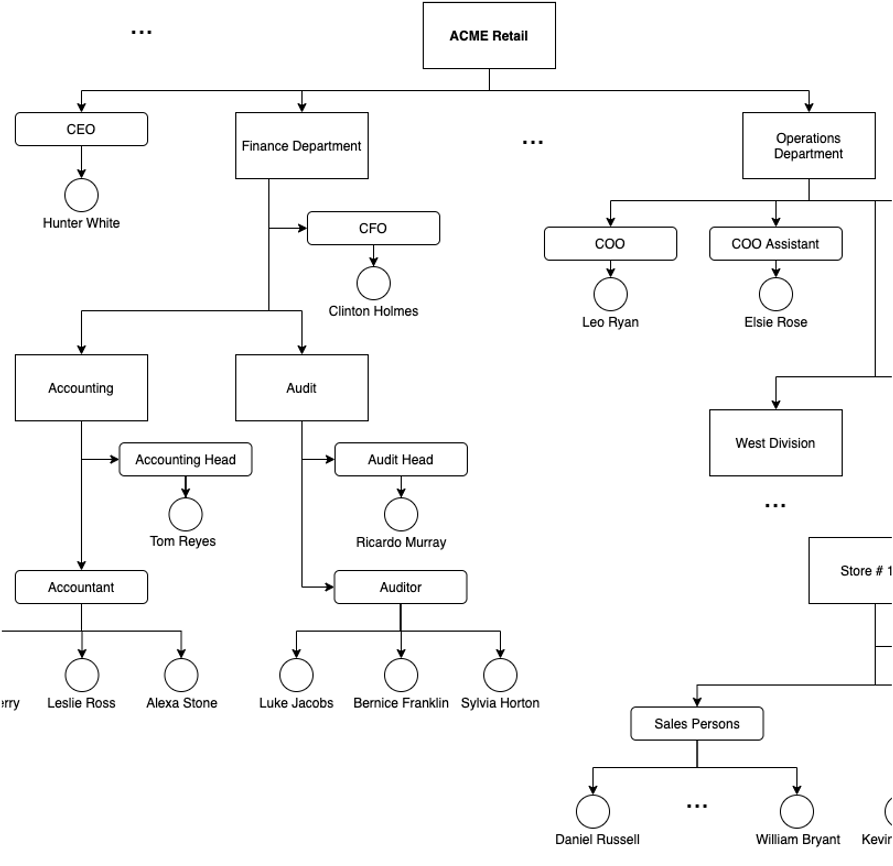

Each organization contains one or more organization units or organizational positions.

Organizational unit can contain subunits or organizational positions.

One or more persons could be assigned to organizational position. 

### Organizational unit

An organizational unit is a subunit of an organization (division, department, etc.) under the control of an official.

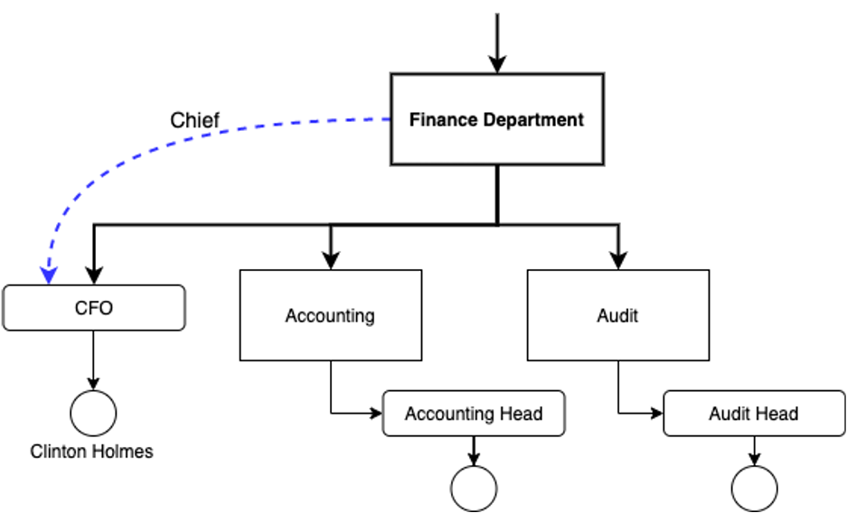

The top-level organizational units are called organizations.

The organizational unit contains:

* Reference to the head of organizational unit. Only one person could be assigned to the head of organizational unit position
* Child elements: organizational units and positions

### Organizational position

An organizational position is a position in the hierarchical structure of an organization.

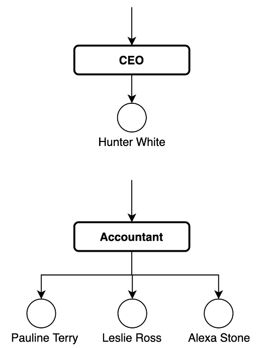

The position belongs to one organizational unit. Positions are assigned to one or more persons.

One person can be assigned to more than one position of one and / or several organizations

### Category

Category is a special attribute that assigned to each organizational item: organization, organizational unit or organizational position. Category is used to classify organization items and search purposes. 

Category’s master data record contains organizational item types it can be assigned to.
The standard categories are follows:
* Organization
* Organizational unit
* Organizational position

List of categories could be extended according business requirements. For example:
* Subcontractor organization
* Customer organization
* Virtual team
* Outstaff position
* Team, etc

### Organizational role

An organizational role is a special attribute that is assigned to an organizational position and is used for authorization and search purposes.

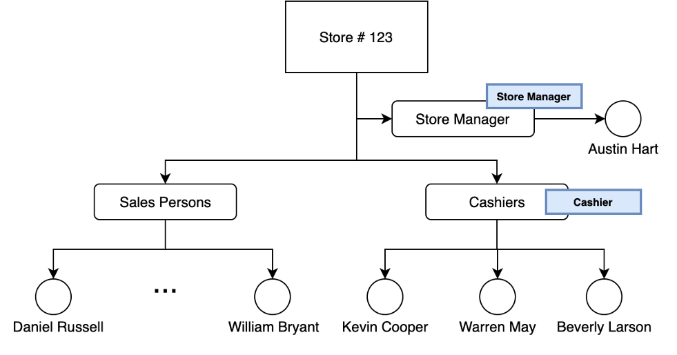

One position can be assigned zero or more organizational roles.

For example, we can create an organizational role Store Manager and assign it to all store manager positions of all stores. And use it  to provide permissions to perform tasks according to store manager's duties.

## Attribute service

Attribute service provide the following functionality:
 
* Maintaining one or more attribute schemas for various microservice entities, including:
* Person (user, contact person, etc.)
* Organizational unit
* Position
* Replicate attribute schemas to microservices to create data schemas in ElasticSearch
* Assigning attribute values to entity objects
* Indexing of entity attribute values to perform full-text search

### Attribute

Since the properties of entities can change depending on the needs of the business, the Annette platform provides the functionality of attributes for flexible configuration of a set of properties of entities.

Attribute is a custom property of a specified type that can be assigned to an entity object.

A set of attributes called an attribute schema is assigned to an entity

In addition to the main entity attribute schema, an unlimited number of attribute subschemas can be defined

### Attribute type

An attribute can be one of the following types:

* string,
* a string with a choice from a list specified,
* boolean value,
* long integer,
* floating point number,
* date / time with time zone,
* date,
* time,
* JSON.

Examples of attributes:

* Gender: male / female - a line with a choice from a list specified
* Date of birth - date
* Publication time - date / time with time zone
* Substitute employee - - a line with a choice from a list specified
* Married - logical

### Attribute full-text search

Attributes can be indexed and used to search entity objects

For example, you can run the following query:

Find all persons for whom the conditions are true
* Gender = female
* Date of birth > 10.08.1990
* Date of birth <= 08/10/2002
* Married = false
