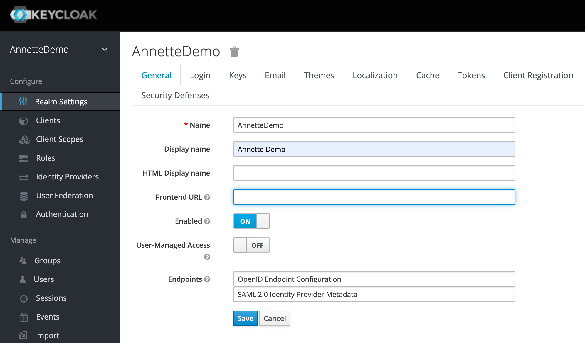
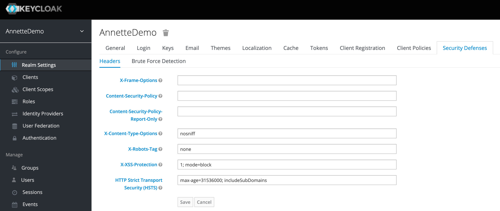
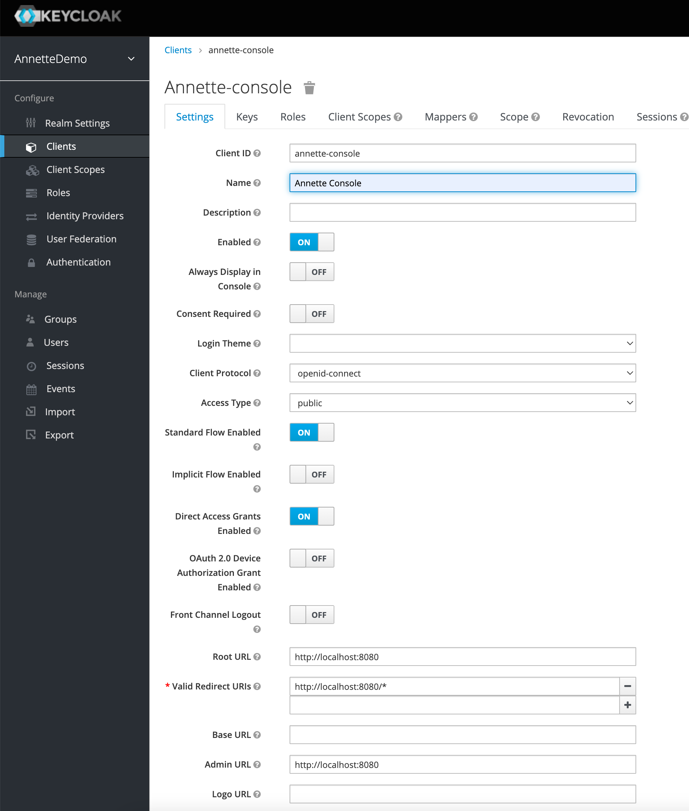
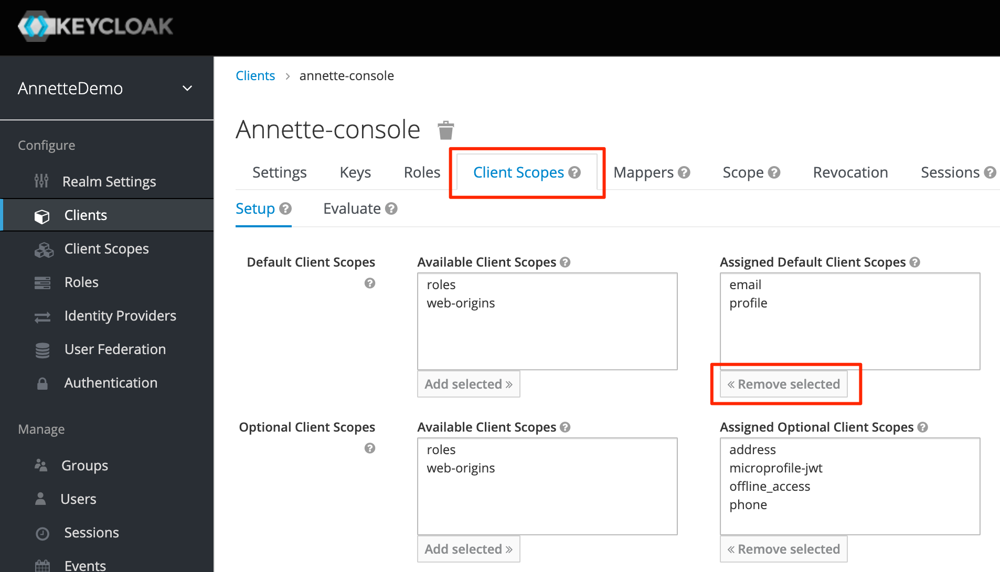
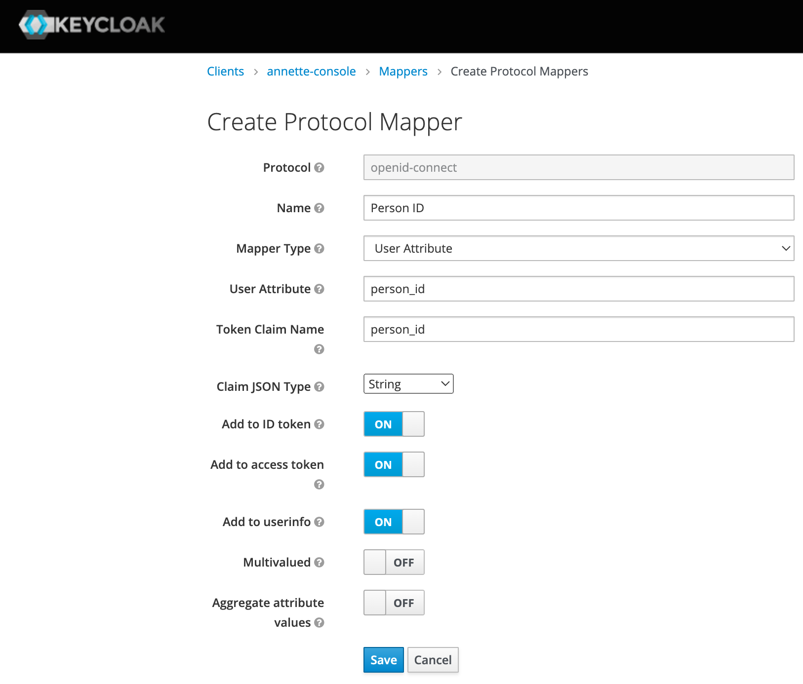
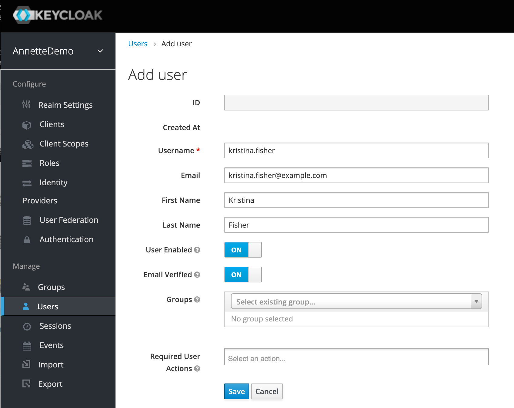
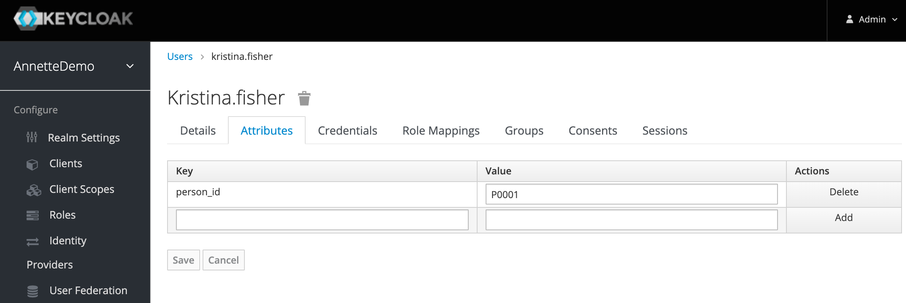
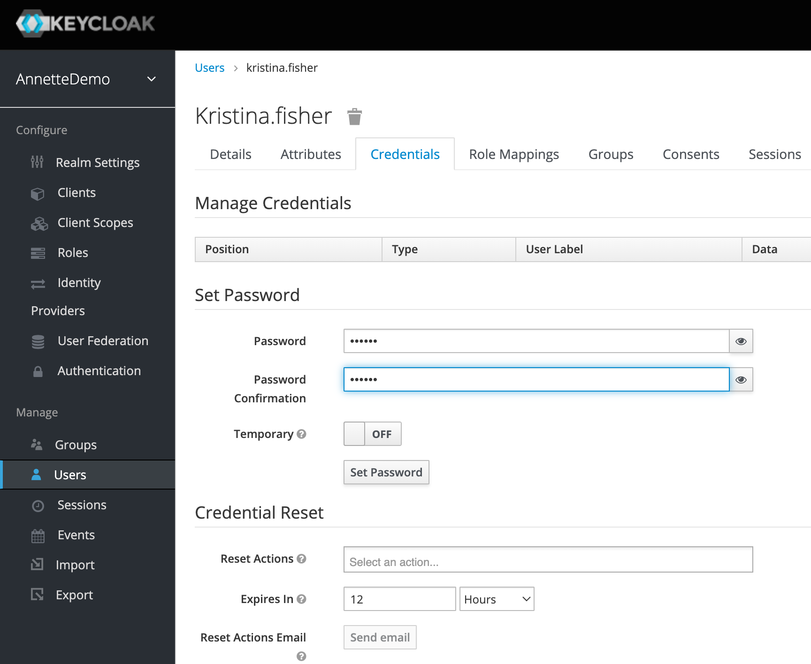

# Prerequisites

To run Annette Platform the following software should be installed:

- Apache Cassandra - NoSQL database providing high available storage to persist data.
- Elastic Search - full text search engine providing indexing of data stored in Cassandra
- Minio - AWS S3 compatible object storage to store files.
- PostgreSQL - relation database for Keycloak (identity provider) and Camunda (business process management system)
- Keycloak - identity management provider to authenticate users.

## Apache Cassandra

Apache Cassandra provides distributed, high available NoSQL database. Annette microservices use Cassandra to persist their state. Annette Platform requires Apache Cassandra version 3.11 or higher. There is no requirement to create keyspaces manually and init keyspace schemas. Annette Microservices will create keyspaces and tables automatically.

### Local installation

For development and evaluation purposes install Apache Cassandra single node cluster. To install perform the following steps:

1. Download Apache Cassandra archive from [Download Page](https://cassandra.apache.org/_/download.html).
2. Extract Cassandra binaries from archive to directory you want. For example (X.X.X - version of Cassandra):

- MacOS - `/Users/<your-username>/apache-cassandra-X.X.X`
- Linux - `/home/<your-username>/apache-cassandra-X.X.X`

3. Start Apache Cassandra using

- MacOS - `/Users/<your-username>/apache-cassandra-X.X.X/bin/cassandra`
- Linux - `/home/<your-username>/apache-cassandra-X.X.X/bin/cassandra`

As alternative you can run Apache Cassandra in Docker container using the following command:

```
docker run -d \
    --name cassandra \
    -p 9042:9042 \
    -v ~/cassandra-data:/var/lib/cassandra \
    cassandra:X.X.X
```

where X.X.X - version of Cassandra.

### Production installation

To download and install Apache Cassandra use the following [link](https://cassandra.apache.org/_/download.html). For production installation it is recommended to enable password authentication (see [Security Guide](https://cassandra.apache.org/doc/latest/cassandra/operating/security.html) in Cassandra documentation).

As example of installation Cassandra cluster with 3 nodes (cas-01, cas-02, cas-03) on CentOS 7 you can use the following steps:

1. Set firewall rules

```
firewall-cmd --permanent --add-port=7000/tcp
firewall-cmd --permanent --add-port=7001/tcp
firewall-cmd --permanent --add-port=7199/tcp
firewall-cmd --permanent --add-port=9042/tcp
firewall-cmd --permanent --add-port=9160/tcp
firewall-cmd --permanent --add-port=9142/tcp
firewall-cmd —reload
```

2. Add Cassandra repo keys `sudo rpm --import https://www.apache.org/dist/cassandra/KEYS`
3. Create Cassandra repo file `sudo vi /etc/yum.repos.d/cassandra.repo`

```
[cassandra]
name=Apache Cassandra
baseurl=https://www.apache.org/dist/cassandra/redhat/311x/
gpgcheck=1
repo_gpgcheck=1
gpgkey=https://www.apache.org/dist/cassandra/KEYS
```

4. Install Cassandra `sudo yum install -y cassandra`
5. Change Cassandra configuration file `sudo vi /etc/cassandra/conf/cassandra.yaml` to set cluster name and set Cassandra seed nodes:

```
cluster_name: 'Annette Cluster'
          - seeds: "cas-01, cas-02, cas-03"
listen_address: cas-01 # for cas-XX machine set cas-XX
rpc_address: cas-01 # for cas-XX machine set cas-XX
```

6. Change Cassandra JVM options `vi /etc/cassandra/conf/jvm.options`

```
-Xms12G
-Xmx12G
```

7. Create Cassandra service file `sudo vi /etc/systemd/system/cassandra.service`

```
[Unit]
Description=Cassandra
After=network.target

[Service]
PIDFile=/var/run/cassandra/cassandra.pid
User=cassandra
Group=cassandra
ExecStart=/usr/sbin/cassandra -f -p /var/run/cassandra/cassandra.pid
StandardOutput=journal
StandardError=journal
LimitNOFILE=100000
LimitMEMLOCK=infinity
LimitNPROC=32768
LimitAS=infinity
Restart=always

[Install]
WantedBy=multi-user.target
```

8. Start Cassandra daemon

```
sudo systemctl daemon-reload
sudo systemctl start cassandra
sudo systemctl enable cassandra
```

9. Check Cassandra status `nodetool status`

To enable Cassandra authentication perform the following steps:

1. Set Cassandra replication factor `cqlsh cas-01`

```
ALTER KEYSPACE system_auth WITH REPLICATION = { 'class' : 'SimpleStrategy', 'replication_factor' : 3 };
```

2. Change Cassandra authenticator `sudo vi /etc/cassandra/conf/cassandra.yaml` on all nodes

```
authenticator: PasswordAuthenticator
```

3. Restart Cassandra `sudo systemctl restart cassandra` on all nodes
4. Set Cassandra password `cqlsh cas-01 -u cassandra -p cassandra`

```
ALTER USER cassandra WITH PASSWORD '<secret password>’;
```

5. Check Cassandra authentication `cqlsh cas-01 -u cassandra -p <secret password>`

## Elastic Search

Elastic Search is used to index data stored in Cassandra. Annette Platform requires Elastic Search version 7.8 or higher. For secured Elastic Search it is recommended to use [Open Distro for Elastic search](https://opendistro.github.io/) (version 1.9.0 or higher).

### Local installation

For development and evaluation purposes install Open Distro single node cluster. To install Open Distro in docker perform the following steps:

1. Create `docker-compose.yml` file

```
version: '3'
services:
  odfe-node1:
    image: amazon/opendistro-for-elasticsearch:1.9.0
    container_name: odfe-node1
    environment:
      - cluster.name=odfe-cluster
      - node.name=odfe-node1
      - discovery.type=single-node
      - bootstrap.memory_lock=true # along with the memlock settings below, disables swapping
      - "ES_JAVA_OPTS=-Xms1024m -Xmx1024m" # minimum and maximum Java heap size, recommend setting both to 50% of system RAM
    ulimits:
      memlock:
        soft: -1
        hard: -1
      nofile:
        soft: 65536 # maximum number of open files for the Elasticsearch user, set to at least 65536 on modern systems
        hard: 65536
    volumes:
      - odfe-data1:/usr/share/elasticsearch/data
    ports:
      - 9200:9200
      - 9600:9600 # required for Performance Analyzer
    networks:
      - odfe-net
  kibana:
    image: amazon/opendistro-for-elasticsearch-kibana:1.9.0
    container_name: odfe-kibana
    ports:
      - 5601:5601
    expose:
      - "5601"
    environment:
      ELASTICSEARCH_URL: https://odfe-node1:9200
      ELASTICSEARCH_HOSTS: https://odfe-node1:9200
    networks:
      - odfe-net

volumes:
  odfe-data1:

networks:
  odfe-net:
```

2. Start Elastic Search `docker-compose up -d`

### Production installation

To download and install Open Distro for Elastic Search use the following [link](https://opendistro.github.io/for-elasticsearch-docs/docs/install/). To secure installation check [Security configuration
](https://opendistro.github.io/for-elasticsearch-docs/docs/security/configuration/).

As example of installation Open Distro for Elastic Search cluster with 3 nodes (es-01, es-02, es-03) on CentOS 7 you can use the following steps:

1. Set firewall rules:

```
firewall-cmd --permanent --add-port=9200/tcp
firewall-cmd --permanent --add-port=9300/tcp
firewall-cmd —reload
```

2. Download Open Distro repo

```
sudo curl https://d3g5vo6xdbdb9a.cloudfront.net/yum/opendistroforelasticsearch-artifacts.repo -o /etc/yum.repos.d/opendistroforelasticsearch-artifacts.repo
```

3. Install Java 11 `sudo yum install java-11-openjdk-devel`

4. Install Open Distro

```
sudo yum install wget unzip
sudo yum list opendistroforelasticsearch --showduplicates
sudo yum install opendistroforelasticsearch-1.9.0
```

5. Change Elastic Search config `sudo vi /etc/elasticsearch/elasticsearch.yml`

```
cluster.name: AnnetteCluster7.8
node.name: \${HOSTNAME}
network.host: [ _ens192_, _local_ ]
bootstrap.memory_lock: true
discovery.seed_hosts: ["es-01, es-02, es-03"]
cluster.initial_master_nodes: ["es-01, es-02, es-03"]
```

6. Change ElasticSearch JVM options `sudo vi /etc/sysconfig/elasticsearch`

```
ES_JAVA_OPTS="-Xms10g -Xmx10g"
MAX_LOCKED_MEMORY=unlimited
```

7. Change ElasticSearch limits `sudo vi /etc/security/limits.conf`

```
elasticsearch soft memlock unlimited
elasticsearch hard memlock unlimited
```

8. Change `LimitMEMLOCK` in service file`sudo vi /usr/lib/systemd/system/elasticsearch.service`

```
LimitMEMLOCK=infinity
```

9. Restart ElasticSearch daemon

```
sudo systemctl daemon-reload
sudo systemctl start elasticsearch.service
sudo systemctl enable elasticsearch.service
```

10. Check Elastic Search

```
curl -XGET https://es-01:9200 -u admin:admin --insecure
curl -XGET "https://es-01:9200/_cat/nodes?v" -u admin:admin --insecure
curl -XGET "https://es-01:9200/_cat/plugins?v" -u admin:admin --insecure
```

11. Create admin password

```
cd /usr/share/elasticsearch/plugins/opendistro_security/tools
sudo sh hash.sh -p <secret password>
$2y$12\$C/543Qr4Y7Zy4Wsq5WvN9uw.WAbpvGghpiXvk9WexZgDfAGuG0OEC
```

12. Change admin password using result of previous command `sudo vi /usr/share/elasticsearch/plugins/opendistro_security/securityconfig/internal_users.yml`

13. Rebuild passwords database for Open Distro

```
sh securityadmin.sh -cd ../securityconfig/ -icl -nhnv -cacert /etc/elasticsearch/root-ca.pem -cert /etc/elasticsearch/kirk.pem -key /etc/elasticsearch/kirk-key.pem
```

## Minio

Minio is AWS S3 compatible object storage. Annette Platform uses Minio to store documents, images and other media content.

### Local installation

For development and evaluation purposes install Minio in docker using the following command:

```
docker run \
   -p 9002:9000 \
   -p 9001:9001 \
   -v minio-data:/data \
   minio/minio:latest server /data --console-address ":9001"
```

### Production installation

For production installation use [Distributed MinIO Quickstart Guide](https://docs.min.io/docs/distributed-minio-quickstart-guide.html)

## PostgreSQL

PostgreSQL is open source relation database management system. Annette Platform uses PostgreSQL for the following services:

- Keycloak - open source Identity and Access Management System that provides user authentication using OpenID Connect
- Camunda - open source workflow and decision automation platform

Annette Platform requires PostgreSQL version 10 or higher.

### Local installation

For development and evaluation purposes install PostgreSQL in docker using the following command:

```
docker run -d \
    --name postgres \
    -e POSTGRES_PASSWORD=postgres \
    -e PGDATA=/var/lib/postgresql/data/pgdata \
    -v pgdata:/var/lib/postgresql/data \
    -p 5432:5432 \
    postgres:latest
```

### Production installation

For production installation use [PostgreSQL Download Page](https://www.postgresql.org/download/).

## Keycloak

Keycloak is open source Identity and Access Management System that provides user authentication using OpenID Connect. Annette Platform requires Keycloak versions 12.0.1 - 16.1.1.

### Local installation

For development and evaluation purposes install Keycloak in docker using the following steps:

1. Create 'docker-compose.yml'

```
version: '3'

volumes:
  keycloak-pg-data:
      driver: local

services:
  postgres:
      image: postgres
      volumes:
        - keycloak-pg-data:/var/lib/postgresql/data
      environment:
        POSTGRES_DB: keycloak
        POSTGRES_USER: keycloak
        POSTGRES_PASSWORD: password
  keycloak:
      image: quay.io/keycloak/keycloak:16.1.1
      environment:
        DB_VENDOR: POSTGRES
        DB_ADDR: postgres
        DB_DATABASE: keycloak
        DB_USER: keycloak
        DB_SCHEMA: public
        DB_PASSWORD: password
        KEYCLOAK_USER: admin
        KEYCLOAK_PASSWORD: admin
      ports:
        - 3080:8080
      depends_on:
        - postgres
```

2. Run command `docker-compose up -d`

### Production installation

For production installation use [Getting Started Guide](https://www.keycloak.org/guides#getting-started).

### Configuration

To configure Keycloak perform the following steps:

1. Create realm `AnnetteDemo`



2. Clear fields `X-Frame-Options` and `Content-Security-Policy` in `Security Defenses` tab



3. Create client `annette-console` with root URL to your application




4. (Optional) Remove unnecessary client scopes `roles` & `web-origins` to reduce size of JWT token



5. Create mapper for person_id. This mapper will include user attribute person_id to JWT token attribute person_id. User attribute person_id links Keycloak user account to person in Annette Platform.



6. Create new user. For Annette Demo create user Kristina Fisher with person_id P0001. This user has admin rights.



7. Add user attribute person_id.



8. Set password for new user


