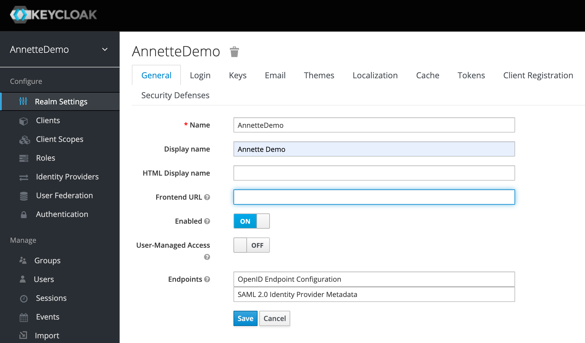
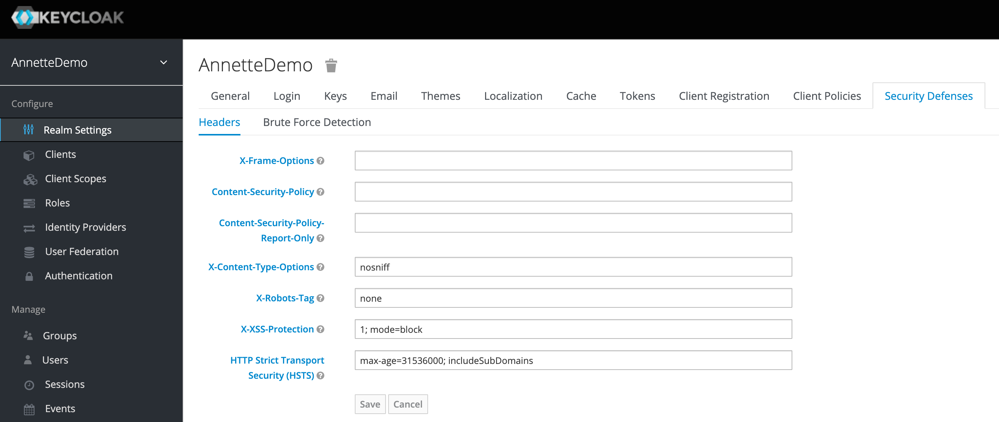
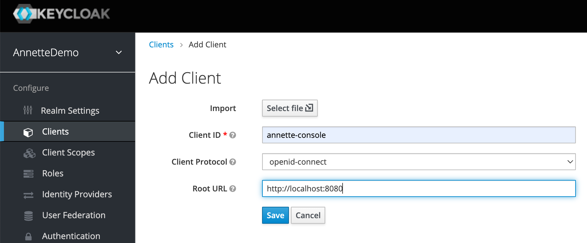
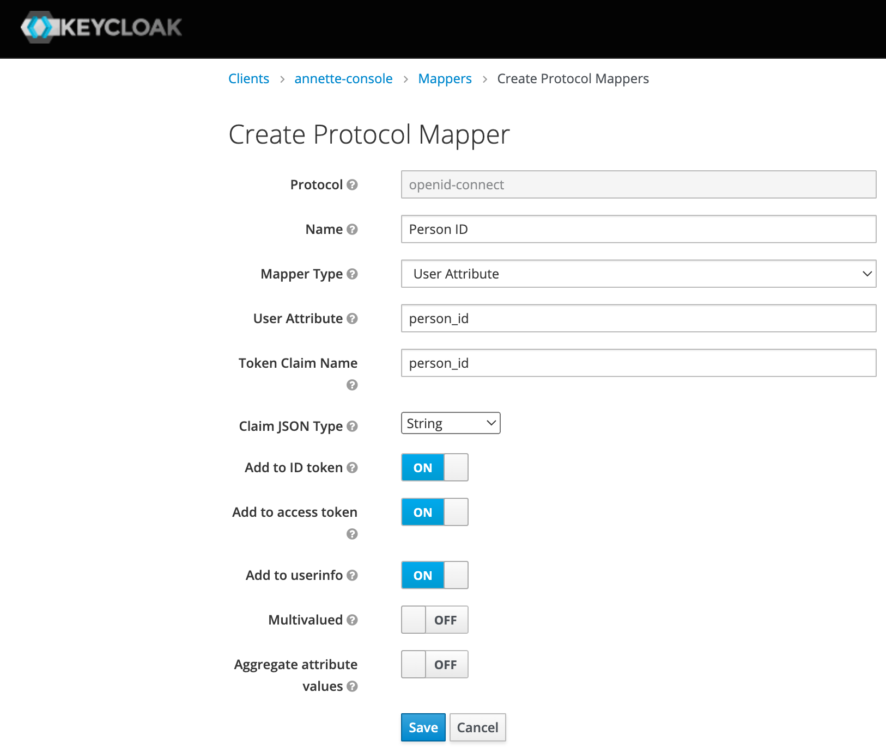
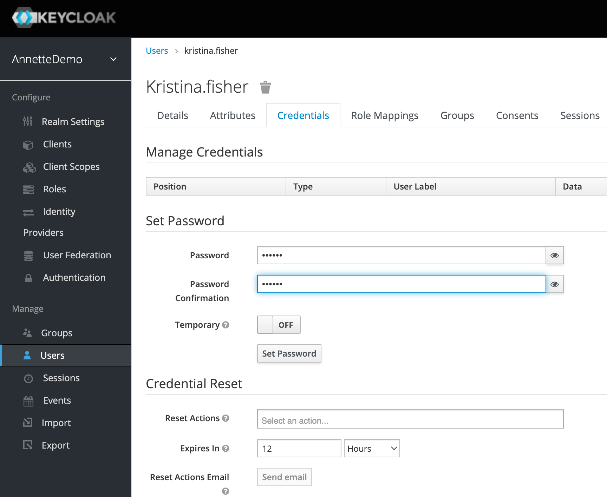

# Development installation

You can perform development installation of Annette Platform for development or evaluation purposes. DO NOT use
development installation in production.

Before install Annette Platform and its prerequisites you have to install the following development tools:

1. Java Development Kit (JDK). JDK is used to build Annette Platform backend. It is recommended to use JDK 11 or 15. To
   install JDK use installation instructions on [Oracle JDK](https://www.oracle.com/java/technologies/downloads/)
   or [Open JDK](https://jdk.java.net/).
2. Scala Build Tool (SBT). SBT is used to build Scala applications. To install SBT use installation instructions
   on [SBT website](https://www.scala-sbt.org/download.html)
3. Node JS. Node JS is used to build Annette Platform frontend. It is recommended to use version 14.17.0. To install
   Node JS go [Node JS website](https://nodejs.org/).
4. Quasar Framework. Quasar Framework is framework to create nice web and mobile applications. To install use
   command `yarn global add @quasar/cli` or `npm i -g @quasar/cli`.
5. Docker. To run Annette Platform prerequisites such as databases and identity management provider you need `docker`.
   To install Docker visit [Docker website](https://www.docker.com/get-started/)

## Prerequisites

To run Annette Platform the following software should be installed:

- Apache Cassandra - NoSQL database providing high available storage to persist data.
- Elastic Search - full text search engine providing indexing of data stored in Cassandra
- Minio - AWS S3 compatible object storage to store files.
- PostgreSQL - relation database for Keycloak (identity provider) and Camunda (business process management system)
- Keycloak - identity management provider to authenticate users.

To install prerequisites in docker perform the following steps:

1. Clone [Annette Platform repository](https://github.com/annetteplatform/annette) using
   command `git clone https://github.com/annetteplatform/annette.git`
2. Change directory to `annette/deploy/docker-local` using command `cd annette/deploy/docker-local`.
3. Run deployment script `./deploy.sh`.

After deployment the following applications will be available:

- [Camunda](http://localhost:3090). Login - camunda, password - camunda.
- Apache Cassandra on port 9042. No authentication is required.
- [Keycloak](http://localhost:3080). Login - admin, password - admin. It is requires configuration steps to be
  performed (see below).
- [Minio](http://localhost:9002) with default access-key-id - minioadmin and secret-access-key - minioadmin.
- PostgreSQL on port 5432. The following databases are created:
    - `postgres`, login - `postgres`, password - `password`
    - `keycloak`, login - `keycloak`, password - `keycloak`
    - `camunda`, login - `camunda`, password - `camunda`
    - `dev_bpm_repository`, login - `bpm_repository`, password - `bpm_repository`
- Open Distro for Elastic Search on port 9200. Login - admin, password - admin.
- [Kibana](http://localhost:5601). Login - admin, password - admin.

## Keycloak Configuration

To configure Keycloak perform the following steps:

1. Create realm `AnnetteDemo`



2. Clear fields `X-Frame-Options` and `Content-Security-Policy` in `Security Defenses` tab



3. Create client `annette-console` with root URL to your application




4. (Optional) Remove unnecessary client scopes `roles` & `web-origins` to reduce size of JWT token


5. Create mapper for person_id. This mapper will include user attribute person_id to JWT token attribute person_id. User
   attribute person_id links Keycloak user account to person in Annette Platform.



6. Create new user. For Annette Demo create user Kristina Fisher with person_id P0001. This user has admin rights.


7. Add user attribute person_id.


8. Set password for new user



## Start backend

To run Anette Platform backend perform the following steps:

1. Clone [Annette Platform repository](https://github.com/annetteplatform/annette) using
   command `git clone https://github.com/annetteplatform/annette.git`
2. Change directory to `annette` using command `cd annette`.
3. Build source code using command `sbt compile`.
4. Run Annette Platform backend using the following script:

```bash
#!/usr/bin/env bash

export INDEX_PREFIX="dev-"
export INDEXING_ALLOW_INSECURE="true"
export KEYSPACE_PREFIX="dev_"
export POSTGRES_PREFIX="dev_"
export CMS_STORAGE_BUCKET_PREFIX="dev-"
export MINIO_PREFIX="dev_"
export KEYCLOAK_CLIENT="annette-console"
export KEYCLOAK_REALM="AnnetteDemo"
export KEYCLOAK_URL="http://localhost:3080/auth"
sbt -Dsbt.supershell=false -Dconfig.resource="application.dev.conf" runAll
```

After that Annette Platform backend will be available at `localhost:9000`.

## Start frontend

To run Anette Platform frontend perform the following steps:

1. Clone [Annette Platform Frontend repository](https://github.com/annetteplatform/annette-front) using
   command `git clone https://github.com/annetteplatform/annette-front.git`
2. Change directory to `annette-front` using command `cd annette-front`.
3. Install frontend dependencies using command `yarn install` or `npm install`.
4. Run Annette Platform frontend using the following script:

```bash
#!/usr/bin/env bash

export KEYCLOAK_CONFIG="{\"realm\":\"AnnetteDemo\",\"url\":\"http://localhost:3080/auth/\",\"clientId\":\"annette-console\"}"
export API_TARGET=http://localhost:9000/
quasar dev
```

After that Annette Platform frontend will be available at [localhost:8080](http://localhost:8080) For authentication use
login `kristina.fisher` and password you set on step 8 during Keycloak configuration.
