# Solutions in production

Annette is stable and mature platform. It is battle tested in large environments with hundreds of concurrent users. 
There are number of applications that has been developed using it, such as:
* TELE2 Logistics System for SAP ERP on HANA — user friendly interface for performing logistics operations (material 
  procurements, movements and consumption) in SAP HANA (approx. 700 users);
* Smart City IoT System for EMERCOM of Tyumen Region  - City environment monitoring system for EMERCOM of Tyumen Region
* MIMC Application Processing System — system for registration and expert evaluation applications to Moscow International 
  Medical Cluster (approx. 100 users);
* Construction Project Management System for Moscow Construction Department — system to manage construction projects in 
  Moscow (more than 10000 users);
* Construction Worker’s Safety Control System for Moscow Construction Department — IoT hardware and software solution, 
  based on LoRaWAN technologies, to control worker’s presence, location and safety on construction sites 
  (more than 3000 users);
* Eldorado MVideo Enterprise Portal (EM Life) — enterprise collaboration and communication system integrated with 
  SAP HCM, SAP BW and others corporate information systems at one of Russian largest retailer MVideo Eldorado 
  (approx. 30000 users). EMLife won Russian Intranet Award in nomination Intranet of the Year and international silver 
  award Intranet 2020     

## Logistics System for SAP ERP on HANA

TELE2 Logistics System for SAP ERP on HANA — user friendly interface for performing logistics operations (material 
  procurements, movements and consumption) in SAP HANA (approx. 700 users);

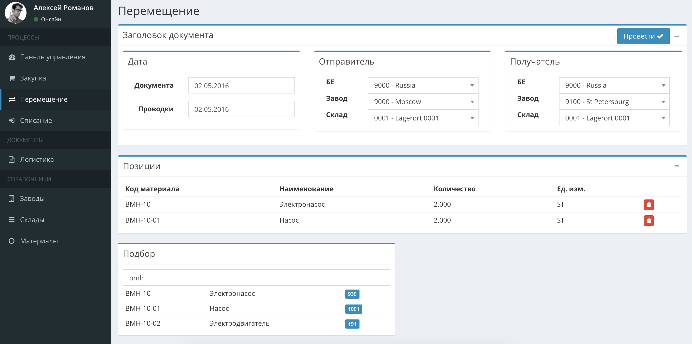

## Smart City IoT System

Smart City IoT System for EMERCOM of Tyumen Region  - City environment monitoring system for EMERCOM of Tyumen Region

Smart City Dashboard

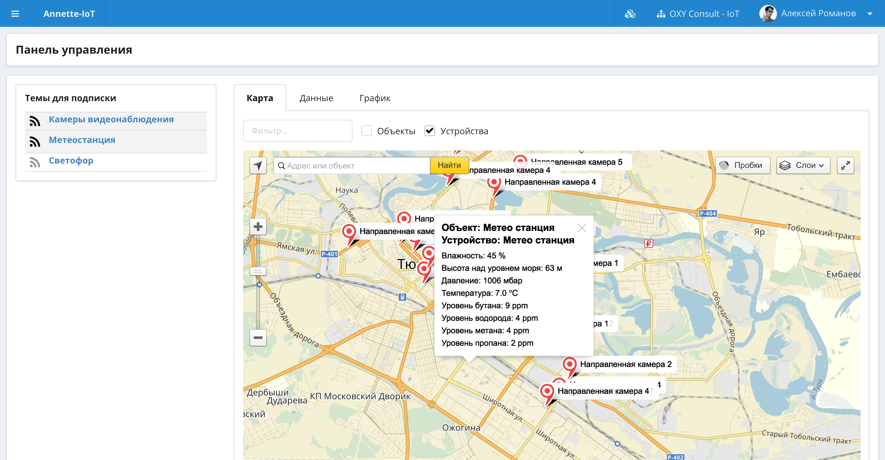

Topic subscription control pane 

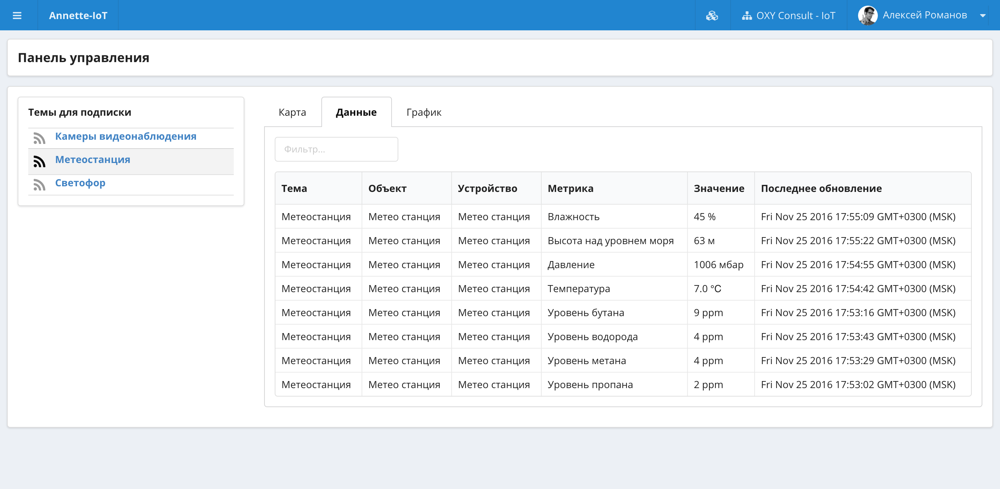

Monitoring chart

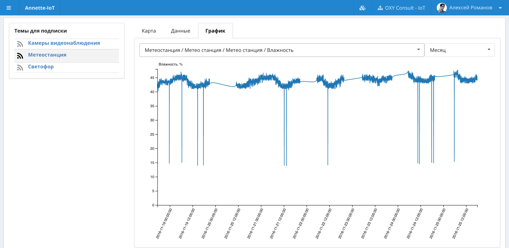

Topic management panel

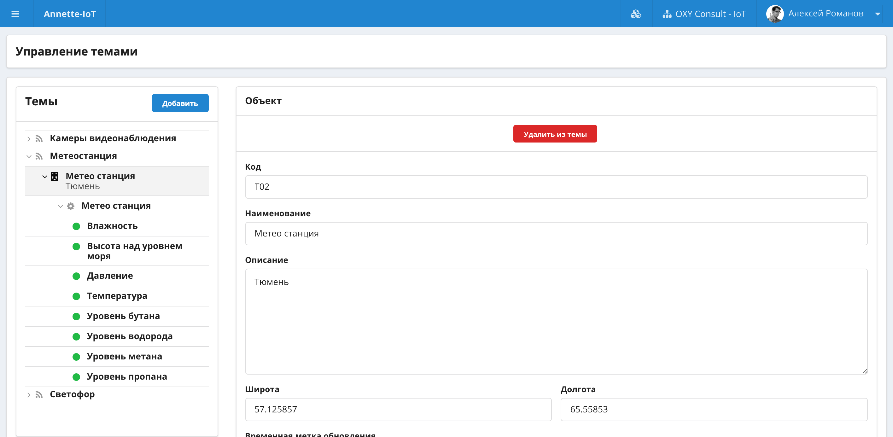

## MIMC Application Processing System

MIMC Application Processing System — system for registration and expert evaluation applications to Moscow International 
  Medical Cluster (approx. 100 users);
 

## Construction Project Management System

 Construction Project Management System for Moscow Construction Department — system to manage construction projects in 
  Moscow (more than 10000 users);
  
Task dashboard
 
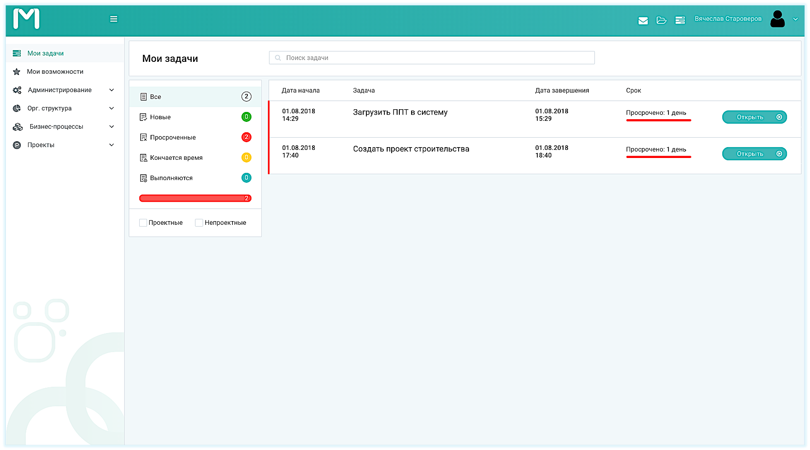

BPMN diagram designer 

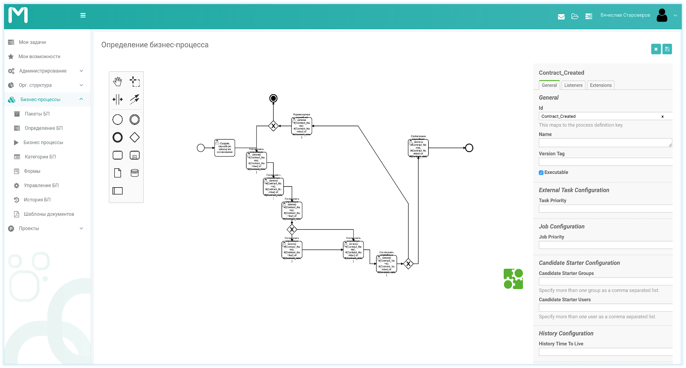

User form designer

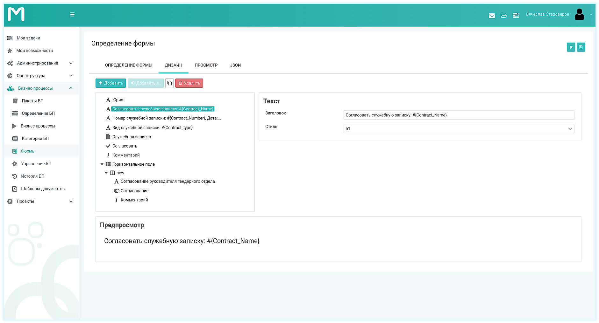

Organizational structure designer

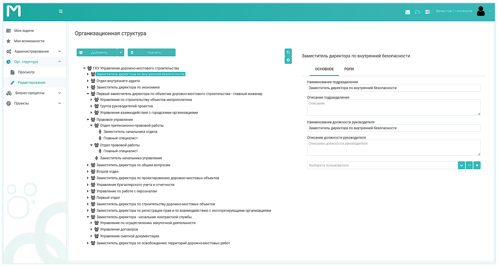

Project card

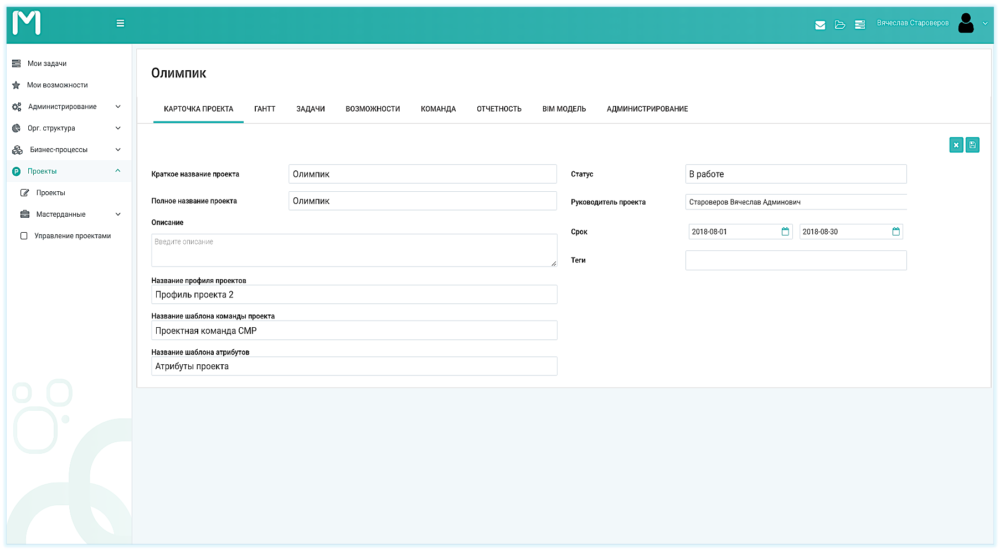

Project Gantt

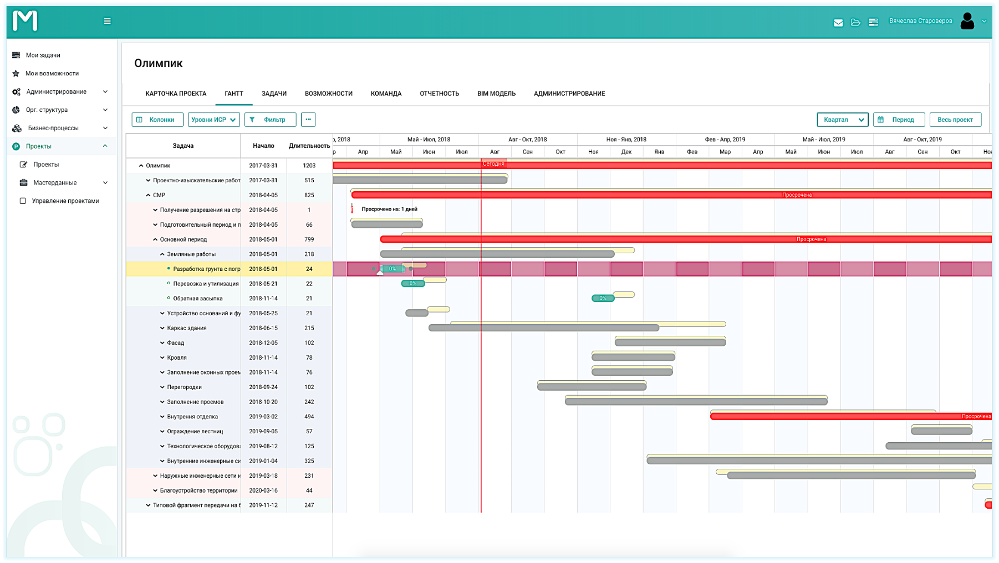

Construction BIM model viewer

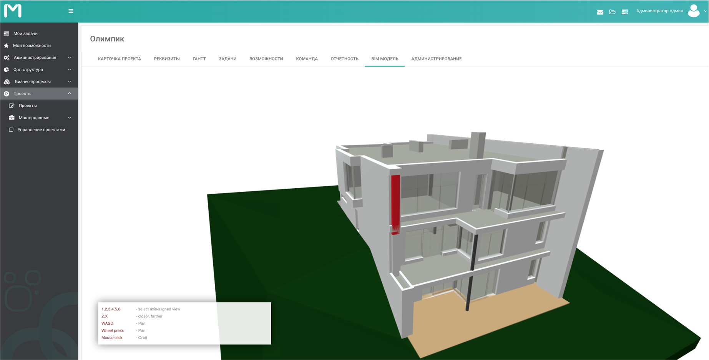  

## Worker’s Safety Control System

Construction Worker’s Safety Control System for Moscow Construction Department — IoT hardware and software solution, 
  based on LoRaWAN technologies, to control worker’s presence, location and safety on construction sites 
  (more than 3000 users);
  
## Enterprise Portal
  
Eldorado MVideo Enterprise Portal (EM Life) — enterprise collaboration and communication system integrated with 
  SAP HCM, SAP BW and others corporate information systems at one of Russian largest retailer MVideo Eldorado 
  (approx. 30000 users). EMLife won Russian Intranet Award in nomination Intranet of the Year and international silver 
  award Intranet 2020 
